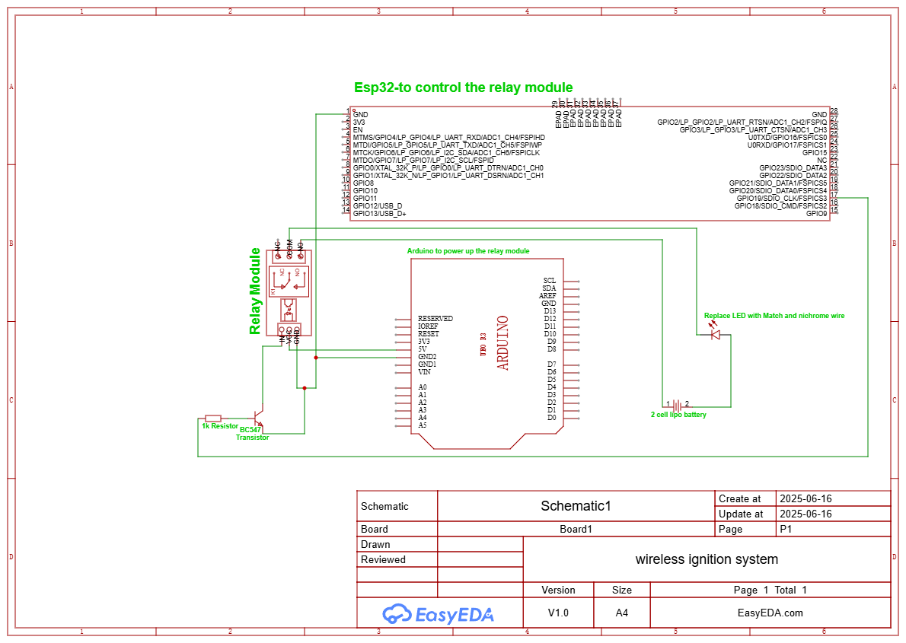

# Wireless-Ignition-System

This project demonstrates a safe and controlled method to ignite a matchstick using:
- **ESP32** for Bluetooth control
- **Relay Module** for switching high-current loads
- **Transistor** as a signal amplifier
- **Nichrome wire / steel wool** as the igniter
- **Battery power** for heating

Controlled via Bluetooth, this project uses a relay to deliver power to a heating wire, which in turn ignites a matchstick.

---

## 🚀 Features
- 🔥 Bluetooth-triggered ignition using ESP32
- 🧠 Transistor-controlled relay switching
- 💥 Safe current flow through nichrome wire for match ignition
- 📱 Compatible with Android Bluetooth Terminal apps

---

## 📦 Components
See detailed part list in [components needed/Components.md](components%20needed/Components.md)

---

## 🧰 Wiring Instructions
Step-by-step connection guide in [Wiring Guide/Wiring_Guide.md](Wiring%20Guide/Wiring_Guide.md)

---

## 📷 Schematic

---

## 🎥 Demo Video
Watch the project in action:  
[Video of the Project Working](video%20of%20the%20project%20working/Ignition_System_Working.mp4)

---

## 📜 License
This project is licensed under the MIT License.

